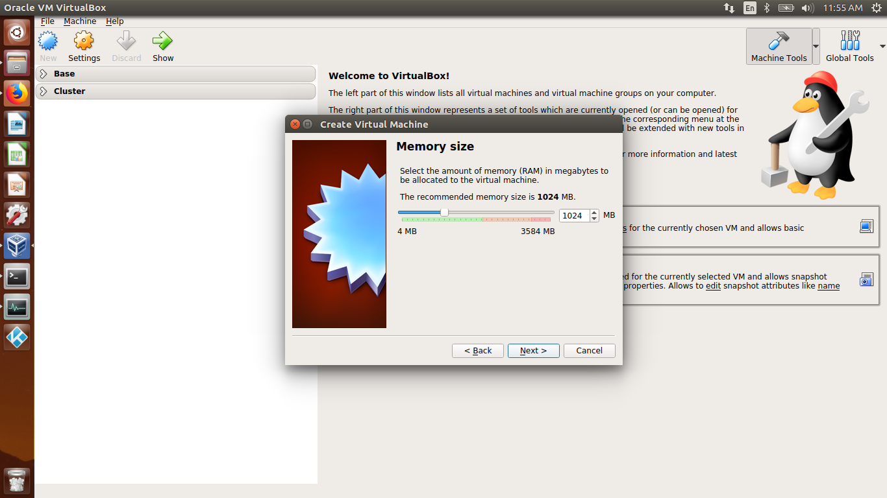
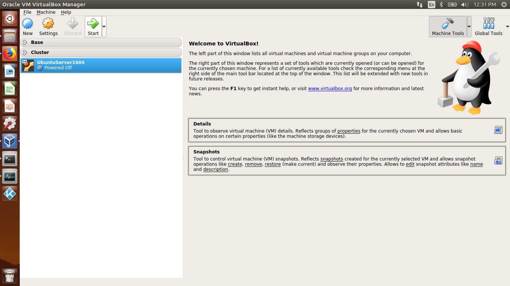
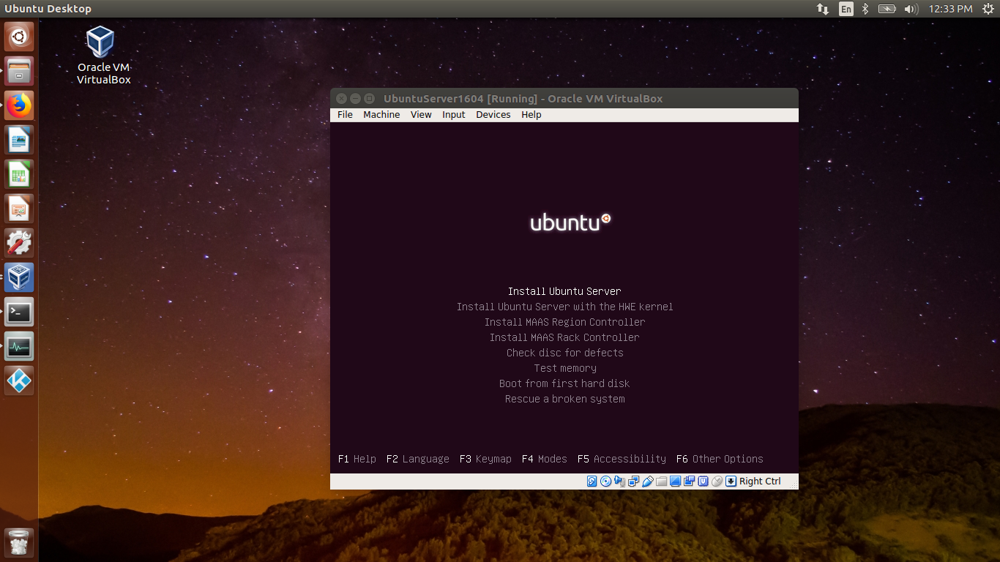
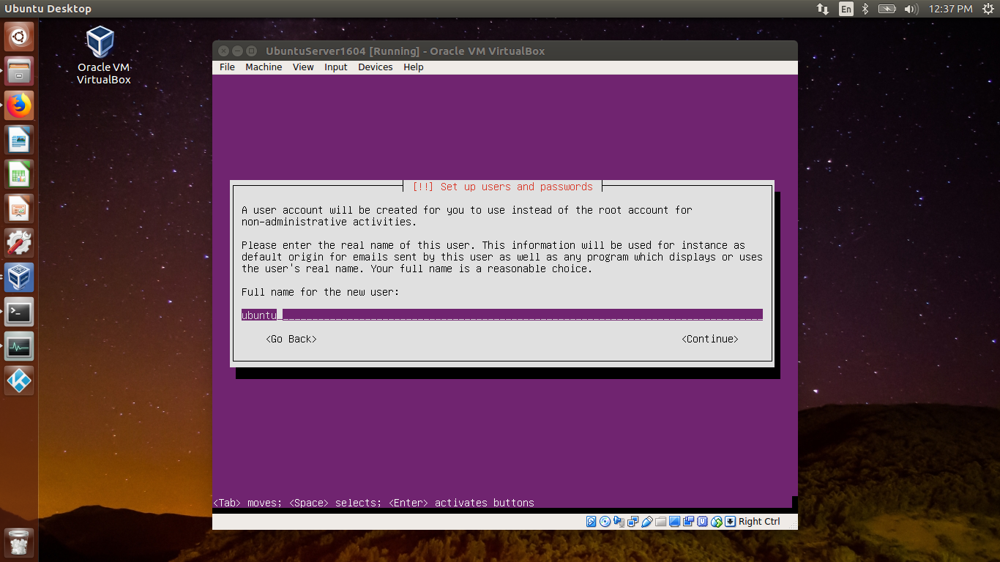
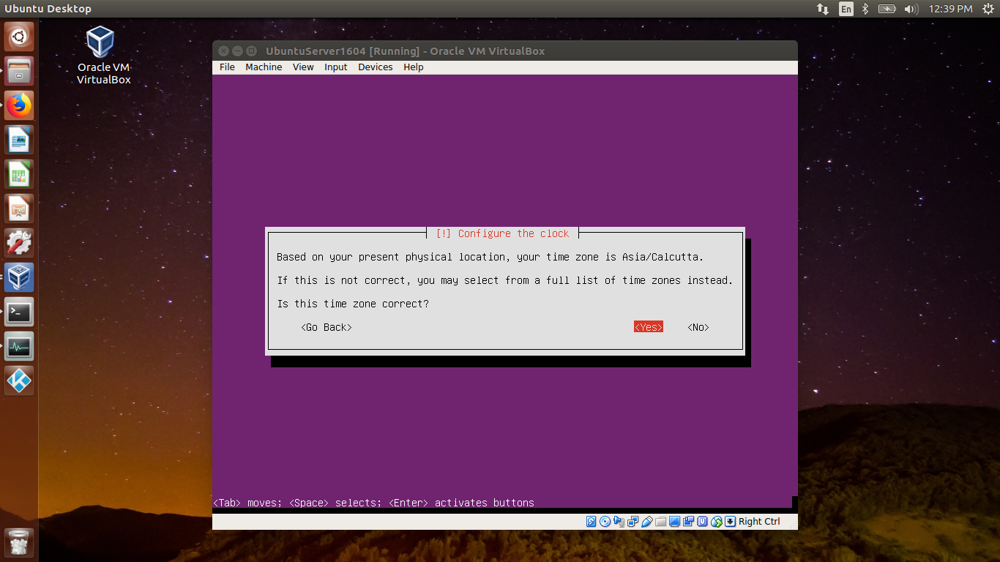
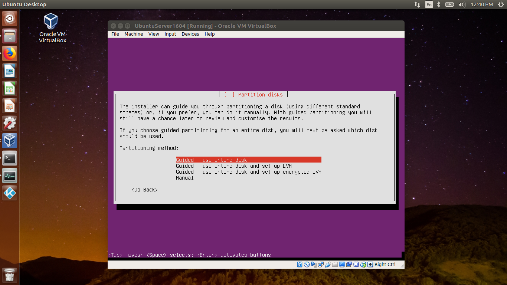
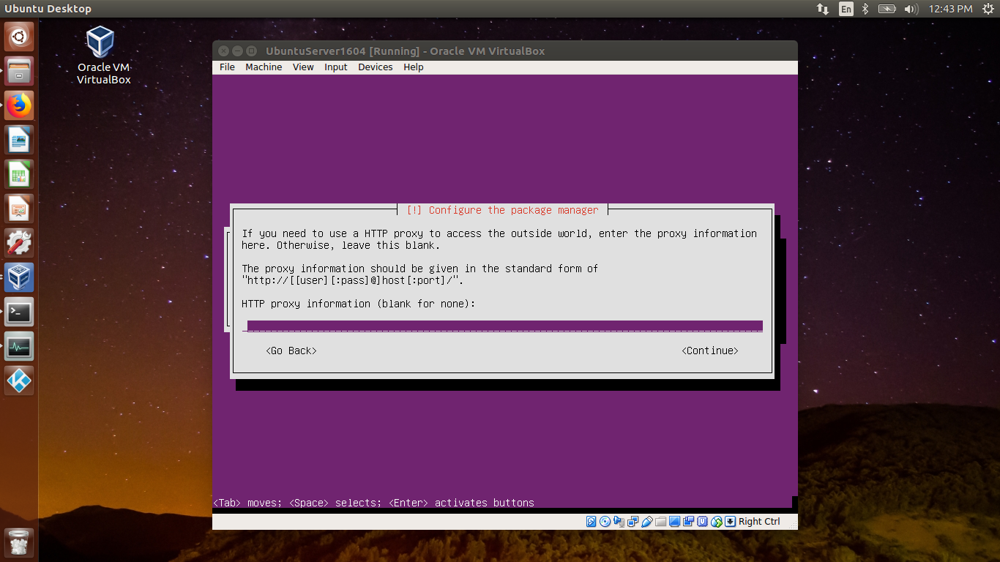
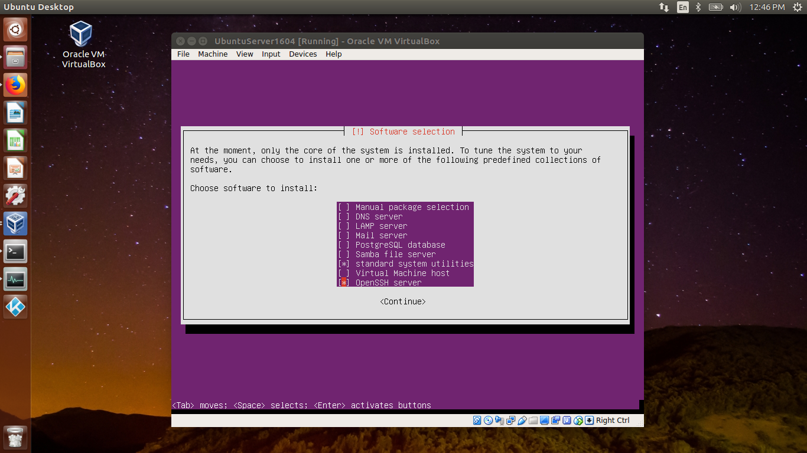

# Ubuntu Server 16.04 Setup

## Create Machine

### Download Ubuntu Server [Click here](https://www.ubuntu.com/download/alternative-downloads)
<div>
	<div align="center">
		
	</div>
</div>

### Use Transmission to Download File
<div>
	<div align="center">
		
	</div>
</div>

### Click Open
<div>
	<div align="center">
		
	</div>
</div>

### Open Oracle VM VirtualBox
<div>
	<div align="center">
		
	</div>
</div>

### Click on New in menu bar
<div>
	<div align="center">
		
	</div>
</div>

### Name the server
<div>
	<div align="center">
		
	</div>
</div>

### Set the memory allocated to machine
<div>
	<div align="center">
		
	</div>
</div>

### Create a virtual hard disk
<div>
	<div align="center">
		
	</div>
</div>

### Select virtual hard disk type
<div>
	<div align="center">
		
	</div>
</div>

### Set fixed size for virtual hard disk
<div>
	<div align="center">
		
	</div>
</div>

### Set size for virtual hard disk
<div>
	<div align="center">
		
	</div>
</div>

### Machine created
<div>
	<div align="center">
		
	</div>
</div>

### Click on machine settings
<div>
	<div align="center">
		
	</div>
</div>

### Settings dialog box
<div>
	<div align="center">
		
	</div>
</div>

### Modify network settings, select bridged adapter, set mac address
<div>
	<div align="center">
		
	</div>
</div>

### Modify storage settings, select optical drive
<div>
	<div align="center">
		
	</div>
</div>

### Select OS image
<div>
	<div align="center">
		
	</div>
</div>

### Click on OK
<div>
	<div align="center">
		
	</div>
</div>

### Start the Virtual Machine
<div>
	<div align="center">
		
	</div>
</div>

### Select Language
<div>
	<div align="center">
		
	</div>
</div>

### Select Install Ubuntu Server
<div>
	<div align="center">
		
	</div>
</div>

### Select Language
<div>
	<div align="center">
		
	</div>
</div>

### Select Location
<div>
	<div align="center">
		
	</div>
</div>

### Configure Keyboard
<div>
	<div align="center">
		
	</div>
</div>

### Enter a Hostname
<div>
	<div align="center">
		
	</div>
</div>

### Enter full name for user
<div>
	<div align="center">
		
	</div>
</div>

### Enter Username
<div>
	<div align="center">
		
	</div>
</div>

### Enter Password
<div>
	<div align="center">
		
	</div>
</div>

### Re-enter Password
<div>
	<div align="center">
		
	</div>
</div>

### If Password is weak, following prompt is displayed, you can choose to ignore this warning
<div>
	<div align="center">
		
	</div>
</div>

### Encrypt home directory if required
<div>
	<div align="center">
		
	</div>
</div>

### Configure clock
<div>
	<div align="center">
		
	</div>
</div>

### Partition Disks, Prompt 1
<div>
	<div align="center">
		
	</div>
</div>

### Partition Disks, Prompt 2
<div>
	<div align="center">
		
	</div>
</div>

### Partition Disks, Prompt 3
<div>
	<div align="center">
		
	</div>
</div>

### Enter HTTP Proxy Information
<div>
	<div align="center">
		
	</div>
</div>

### Configure Automatic Updates
<div>
	<div align="center">
		
	</div>
</div>

### Select Softwares
<div>
	<div align="center">
		
	</div>
</div>

### Install GRUB Loader
<div>
	<div align="center">
		
	</div>
</div>

### Finish Installation
<div>
	<div align="center">
		
	</div>
</div>

### Login to Machine
<div>
	<div align="center">
		
	</div>
</div>

### Machine Running
<div>
	<div align="center">
		
	</div>
</div>

## Update Server
```
sudo apt-get update
sudo apt-get upgrade -y
sudo apt-get dist-upgrade -y
```

## Install Java

### Download and Install Java
```
sudo apt-get update
sudo apt-get install software-properties-common -y
sudo add-apt-repository ppa:webupd8team/java
sudo apt-get update
sudo apt-get install oracle-java9-installer -y
sudo add-apt-repository --remove ppa:webupd8team/java -y
```

### Add to .bashrc
```
cd
echo '' >> .bashrc
echo 'export JAVA_HOME=/usr/lib/jvm/java-9-oracle' >> .bashrc
echo 'export PATH=$PATH:$JAVA_HOME/bin' >> .bashrc
source .bashrc
```

### Check Installation
```
java -version
javac -version
```

## Install Node.js
### Download and Install Node.js
```
sudo apt-get update
sudo apt-get install nodejs -y
sudo apt-get install npm -y
sudo ln -s `which nodejs` /usr/bin/node
```

### Check Installation
```
node -v
npm -v
```

